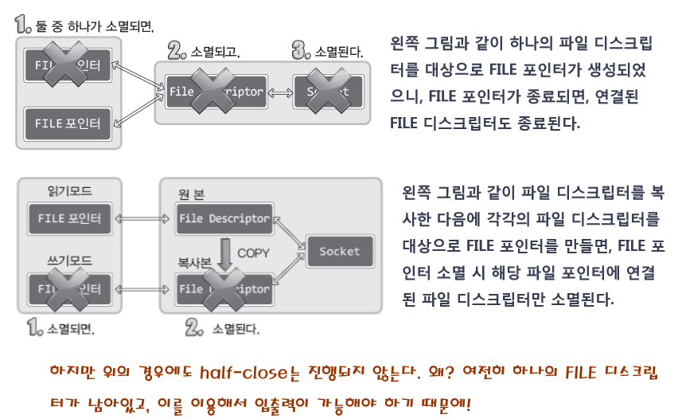

# CH 16\. 입출력 스트림의 분리에 대한 나머지 이야기

## 스트림 종료 시 half-close가 진행되지 않는 이유



### 2번째 방법의 구현 방법
파일 디스크립터의 복사 방법
```c
#include <unistd.h>

// 성공 시 복사된 파일 디스크립터, 실패 시 -1 반환
int dup(int fildes);
int dup2(int fildes, int fildes2);
```
- `fildes` : 복사할 파일 디스크립터 전달.
- `fildes2` : 명시적으로 지정할 파일 디스크립터의 정수 값 전달.

> dup 함수를 이용한 파일 디스크립터 복사 예제
>
> [dup.c](https://github.com/wheejinv/C-TCPIP-Practice/blob/master/Linux/16_%EC%9E%85%EC%B6%9C%EB%A0%A5%20%EC%8A%A4%ED%8A%B8%EB%A6%BC%EC%9D%98%20%EB%B6%84%EB%A6%AC/dup.c)

### 파일 디스크립터의 복사 후 스트림의 분리 방법
복사된 파일 디스크립터의 수에 상관없이 EOF의 전송을 동반하는 Half-close를 진행하기 위해서는 shutdown 함수를 호출해야 함.
shutdown 함수가 호출되면 복사 된 파일 디스크립터의 수에 상관없이 Half-close가 진행되며, 이 과정에서 EOF가 전달된다.

> shutdown 을 활용한 스트림의 분리 방법
>
> [sep_serv2.c](https://github.com/wheejinv/C-TCPIP-Practice/blob/master/Linux/16_%EC%9E%85%EC%B6%9C%EB%A0%A5%20%EC%8A%A4%ED%8A%B8%EB%A6%BC%EC%9D%98%20%EB%B6%84%EB%A6%AC/sep_serv2.c)<br>
> [sep_clnt.c](https://github.com/wheejinv/C-TCPIP-Practice/blob/master/Linux/16_%EC%9E%85%EC%B6%9C%EB%A0%A5%20%EC%8A%A4%ED%8A%B8%EB%A6%BC%EC%9D%98%20%EB%B6%84%EB%A6%AC/sep_clnt.c)
