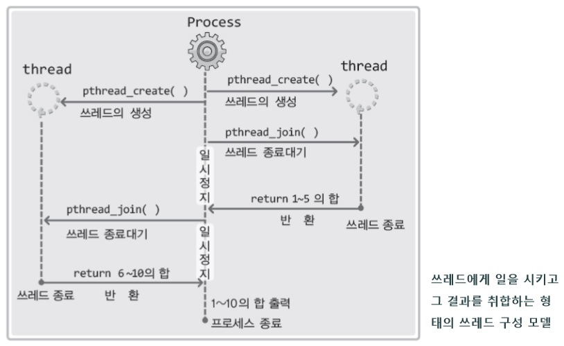
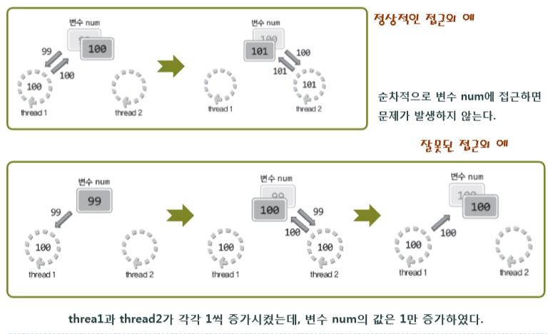

# CH 18\. 멀티쓰레드 기반의 서버구현

## 18-1\. 쓰레드의 이론적 이해

### 멀티프로세스 기반의 단점

- 프로세스 생성이라는 부담스러운 작업과정을 거친다.
- 두 프로세스 사이에서의데이터 교환을 위해서는 별도의 IPC 기법을 적용해야 한다.
- **초당 적게는 수십 번에서 많게는 수천 번까지 일어나는** `컨텍스트 스위칭(Context Switching)에 따른 부담은 프로세스 생성방식의 가장 큰 부담이다.`

### 쓰레드와 프로세스의 차이점

프로세스의 메모리 구조는 전역변수가 할당되는 `데이터 영역`, malloc 함수 등에 의해 동적 할당이 이뤄지는 `힙(Heap)` 그리고 함수의 실행에 사용되는 `스택(Stack)`으로 이뤄진다. 여기에서 스택 영역만을 분리시킴으로써 다음의 장점을 얻을 수 있다.

- 컨텐스트 스위칭 시 데이터 영역과 힙은 올리고 내릴 필요가 없다.
- 데이터 영역과 힙을 이용해서 데이터를 교환할 수 있다.

## 18-2\. 쓰레드의 생성 및 실행

POSIX는 Portable Operation System Interface for Computer Environment의 약자로써 UNIX 계열 운영체제간에 이식성을 높이기 위한 표준 API 규격을 뜻함. 때문에 리눅스뿐만 아니라, 유닉스 계열의 운영체제에서도 대부분 적용 가능하다.

### 쓰레드의 생성과 실행흐름의 구성

쓰레드는 별도의 실행흐름을 갖기 때문에 쓰레드만의 main 함수를 별도로 정의해야 한다. 그리고 이 함수를 시작으로 별도의 실행흐름을 형성해 줄것을 운영체제에게 요청해야 한다.

#### 쓰레드의 생성

```c
#include <pthread.h>

int pthread_create (
  // 성공 시 0, 실패 시 0 이외의 값 반환
  pthread_t *restrict thread, const pthread_attr_t *restrict atrr,
  void *(*start_rutine)(void *), void *restict arg
);
```

- `thread` : 생성할 쓰레드의 ID 저장을 위한 변수의 주소 값 전달. 참고로 쓰레드는 프로세스와 마찬가지로 쓰레드의 구분을 위한 ID가 부여됨.
- `attr` : 쓰레드에 부여할 특성 정보의 전달을 위한 매개변수, NULL: 전달 시 기본적인 특성의 쓰레드가 생성된다.
- `start_routine` : 쓰레드의 main 함수 역할을 하는, 별도 실행흐름의 시작이 되는 함수의 주소 값(함수 포인터) 전달
- `arg` : 세 번째 인다를 통해 등록된 함수가 호출될 때 전달할 인다의 정보를 담고 있는 변수의 주소 값 전달

위의 함수의 매개변수를 이해하려면 키워드 restrict와 함수 포인터 문법을 잘 이해하고 있어야 함.

> 쓰레드의 생성 및 수행 예제<br>
> [thread1.c](https://github.com/wheejinv/C-TCPIP-Practice/blob/master/Linux/18_%EB%A9%80%ED%8B%B0%EC%93%B0%EB%A0%88%EB%93%9C%20%EA%B8%B0%EB%B0%98%EC%9D%98%20%EC%84%9C%EB%B2%84%EA%B5%AC%ED%98%84/thread1.c)<br>

컴파일 방법 **쓰레드 관련 코드는 컴파일 시 -lpthread 옵션을 추가해서 쓰레드 라이브러리의 링크를 별도로 지시해야 함.**

```
$ gcc thread1.c -o th1 -lpthread
```

실행 결과

```
$ ./th1.exe
running thread
running thread
running thread
running thread
running thread
end of main
```

#### 쓰레드의 ID

pthread_join 함수는 첫 번째 인다로 전달되는 ID의 쓰레드가 종료될 때까지, 이 함수를 호출한 프로세스(또는 쓰레드)를 대기상태에 둔다.<br>
또한 쓰레드의 main 함수가 반환하는 값까지 얻을 수 있다.

```c
#include <pthread.h>

// 성공 시 0, 실패 시 0 이외의 값 반환
int pthread_join(pthread_t thread,
                 void    **status);
```

- `thread` : 이 매개변수에 전달되는 ID의 쓰레드가 종료될 때까지 함수는 반환하지 않는다.
- `status` : 쓰레드의 main 함수가 반환하는 값이 저장될 포인터 변수의 주소 값을 전달한다.

> pthread_join 함수의 기능 확인 예제<br>
> [thread2.c](https://github.com/wheejinv/C-TCPIP-Practice/blob/master/Linux/18_%EB%A9%80%ED%8B%B0%EC%93%B0%EB%A0%88%EB%93%9C%20%EA%B8%B0%EB%B0%98%EC%9D%98%20%EC%84%9C%EB%B2%84%EA%B5%AC%ED%98%84/thread2.c)

### 임계영역 내에서 호출이 가능한 함수

`임계영역` : 둘 이상의 쓰레드가 동시에 실행하면 문제를 일으키는 코드 블록을 가리킴.<br>
이러한 임계영역의 문제와 관련해서 함수는 다음 두 가지로 구분됨.<br>

- `쓰레드에 안전한 함수(Thread-safe function)` : 둘 이상의 쓰레드에 의해서 동시에 호출 및 실행되어도 문제를 일으키지 않는 함수. 임계영역의 유무를 뜻하는 것이 아님. 다만 이 영역을 둘 이상의 쓰레드가 동시에 접근해도 문제를 일으키지 않도록 적절한 조지가 이뤄져 있어서 쓰레드에 안전함 함수로 구분될 수 있는 것.
- `쓰레드에 불안전한 함수(Thread-unsafe function)`

다행히 쓰레드에 불안전한 함수가 정의되어 있는 경우, 같은 기능을 갖는 쓰레드에 안전한 함수가 정의되어 있음.<br>
아래는 쓰레드에 불안전한 함수이다.

```c
struct hostent *gethostbyname(const char *hostname);
```

아래는 동일한 기능을 제공하는 쓰레드에 안전한 함수이다.

```c
struct hostent* gethostbyname_r(const char     *name,
                                struct hostent *result,
                                char           *buffer,
                                int             bufrlen,
                                int            *h_errnop);
```

일반적으로 쓰레드에 안전한 형태로 재 구현된 함수의 이름에는 _r이 붙는다.(윈도우와는 다르다.

#### gethostbyname 함수의 호출문을 gethostbyname_r 함수의 호출문으로 변경 방법

- 헤더파일 선언 이전에 매크로 _REENTRANT 를 정의한다.
- 혹은 컴파일 시 -D_REENTRANT 옵션을 추가한다.

  ```
  # gcc -D_REENTRANT mytread.c -o mthread -lpthread
  ```

### 워커(Worker) 쓰레드 모델

둘 이상의 쓰레드가 생성되는 예제이다.<br>
1부터 10까지의 덧셈 결과를 출력하는 예제이다. 그런데 main 함수에서 덧셈을 진행하는 것이 아니라, 두 개의 쓰레드를 생성해서 하나는 1부터 5까지, 다른 하나는 6부터 10까지 덧셈하도록 하고, main 함수에서는 단지 연산결과를 출력하는 형태로 작성해 보고자 함.<br>
이러한 유형의 프로그래밍 모델을 가리켜 `워커 쓰레드(Worker thread) 모델`이라 한다. 1에서부터 5까지, 그리고 6에서부터 10까지 덧셈을 진행하는 쓰레드가 main 함수가 관리하는 일꾼(Worker)의 형태를 띠기 때문이다. 

> 실행결과는 정확하지만 예제 자체적으로는 문제가 있음.<br>
> [thread3.c](https://github.com/wheejinv/C-TCPIP-Practice/blob/master/Linux/18_%EB%A9%80%ED%8B%B0%EC%93%B0%EB%A0%88%EB%93%9C%20%EA%B8%B0%EB%B0%98%EC%9D%98%20%EC%84%9C%EB%B2%84%EA%B5%AC%ED%98%84/thread3.c)

thread3 수행 결과

```
$ gcc -D_REENTRANT thread3.c -o th3 -lpthread
$ ./th3.exe
result: 55
```

> 위의 thread3.c 와 거의 비슷하지만 임계영역과 관련해서 오류의 발생소지를 더 높인 코드<br>
> [thread4.c](https://github.com/wheejinv/C-TCPIP-Practice/blob/master/Linux/18_%EB%A9%80%ED%8B%B0%EC%93%B0%EB%A0%88%EB%93%9C%20%EA%B8%B0%EB%B0%98%EC%9D%98%20%EC%84%9C%EB%B2%84%EA%B5%AC%ED%98%84/thread4.c)

## 18-3\. 쓰레드의 문제점과 임계영역



코드 상에서의 임계영역

```c
void* thread_inc(void *arg)
{
  int i;

  for (i = 0; i < 50000000; i++) {
    num += 1;     // 임계 영역
  }

  return NULL;
}

void* thread_des(void *arg)
{
  int i;

  for (i = 0; i < 50000000; i++) {
    num -= 1;     // 임계 영역
  }

  return NULL;
}
```

## 18-4\. 쓰레드 동기화

쓰레드가 지니는 문제점인 임계영역의 해결책을 가리켜 `쓰레드 동기화(Synchronization)`라 한다.

### 동기화의 두 가지 측면

동기화가 필요한 상황은 다음 두 가지 측면에서 생각해볼 수 있다.

- 동일한 메모리 영역으로의 동시접근이 발생하는 상황
- 동일한 메모리 영역에 접근하는 쓰레드의 실행순서를 지정해야 하는 상황

  - 예를 들어 쓰레드 A와 B가 있다고 하고, 쓰레드 A는 메모리 공간에 값을 가져다 놓는 역할을 담당하고, 쓰레드 B는 이 값을 가져가는 역할을 담당한다고 해보면 혹시라도 쓰레드 B가 먼저 접근해서 값을 가져가면, 잘못된 결과로 이어진다.

이러한 문제를 해결하기 위해서 뮤텍스(Mutex)와 세마포어(Semaphore)라는 두 가지 동기화 기법이 있다.

### 뮤텍스(Mutex)

현실세계의 임계영역이 화장실이라고 하면 다음은 화장실 사용의 일반적인 규칙이다.

- 화장실의 접근보호를 위해서 들어갈 때 문을 잠그고 나올 때 문을 연다.
- 화장실이 사용 중이라면, 밖에서 대기해야 한다.
- 대기중인 사람이 둘 이상 될 수 있고, 이들은 대기순서에 따라서 화장실에 들어간다.

#### 뮤텍스라 불리는 자물쇠 시스템의 생성 및 소멸함수

```c
#include <pthread.h>

// 성공 시 0, 실패 시 0 이외의 값 반환
int pthread_mutext_init(pthread_mutex_t           *mutext,
                        const pthread_mutexattr_t *attr);
int pthread_mutext_destroy(pthread_mutext_t *mutext);
```

- `mutex` : 뮤텍스 생성시에는 뮤텍스의 참조 값 저장을 위한 변수의 주소 값 전달, 그리고 뮤텍스 소멸 시에는 소멸하고자 하는 뮤텍스의 참조 값을 저장하고 있는 변수의 주소 값 전달
- `attr` : 생성하는 뮤텍스의 특성정보를 담고 있는 변수의 주소 값 전달, 별도의 특성을 지정하지 않는 경우에는 NULL 전달.

자물쇠 시스템에 해당하는 뮤텍스의 생성을 위해서는 다음과 같이 pthread_mutext_t mutex 형 변수가 하나 선언되어야 한다.

```c
pthread_mutex_t mutex;
```

#### 뮤텍스의 임계영역에 설치된 자물쇠를 걸거나 잠그는 함수

```c
#include <pthread.h>

// 성공 시 0, 실패 시 0 이외의 값 반환
int pthread_mutex_lock(pthread_mutex_t *mutex);
int pthread_mutex_unlock(pthread_mutex_t *mutex);
```

뮤텍스가 생성된 상태에서 다음의 형태로 임계영역을 보호하게 된다. 하지만 임계영역으로 빠져나가는 쓰레드가 pthread_mutex_unlock 함수를 호출하지 않는다면, 임계영역으로의 진입을 위해 pthread_mutex_lock 함수는 블로킹 상태에서 빠져나가지 못하게 된다는 사실임.

```c
pthread_mutex_lock(&mutex);
// 임계영역의 시작
// ....
// 임계영역의 끝
pthread_mutex_unlock(&mutex);
```

> thread4.c 에서 보인 문제점 해결 코드<br>
> 예제를 보게 되면 임계영역을 넓게 잡은 코드와 적게 잡은 코드를 비교할 수 있음.<br>
> [mutex.c](https://github.com/wheejinv/C-TCPIP-Practice/blob/master/Linux/18_%EB%A9%80%ED%8B%B0%EC%93%B0%EB%A0%88%EB%93%9C%20%EA%B8%B0%EB%B0%98%EC%9D%98%20%EC%84%9C%EB%B2%84%EA%B5%AC%ED%98%84/mutex.c)

실행결과: mutex.c

```
$ gcc -D_REENTRANT mutex.c -o mu -lpthread
$ ./mu.exe
result: 0
```

### 세마포어(Semaphore)

```c
#include <semaphore.h>

// 성공 시 0, 실패 시 0 이외의 값 반환
int sem_init(sem_t       *sem,
             int          pshared,
             unsigned int value);
int sem_destroy(sem_t *sem);
```

- `sem` : 세마포어 생성시에는 세마포어의 참조 값 저장을 위한 변수의 주소 값 전달, 그리고 세마포어 소멸 시에는 소멸하고자 하는 세마포어의 참조 값을 저장하고 있는 변수의 주소 값 전달.
- `pshared` : 0 이오의 값 전달 시, 둘 이상의 프로세스에 의해 접근 가능한 세마포어 생성, 0 전달 시 하나의 프로세스 내에서만 접근 가능한 세마포어 생성, 여기서는 하나의 프로세스 내에 존재하는 쓰레드의 동기화가 목적이므로 0을 전달한다.
- `value` : 생성되는 세마포어의 초기 값 지정.

#### 뮤텍스 lock, unlock 에 해당하는 세마포어 관련 함수

```c
#include <semaphore.h>

// 성공 시 0, 실패 시 0 이외의 값 반환
int sem_post(sem_t *sem);
int sem_wait(sem_t *sem);
```

- `sem` : 세마포어의 참조 값을 저장하고 있는 변수의 주소 값 전달, sem_post에 전달되면 세마포어의 값은 하나 증가, sem_wait에 전달되면 세마포어의 값은 하나 감소.

#### 세마포어 메커니즘

sem_init 함수가 호출되면 운영체제에 의해서 세마포어 오브젝트라는 것이 만들어 지는데, 이곳에는 `세마포어 값(Semaphore value)`이라 불리는 정수가 하나 기록됨.<br>
그리고 이 값은

- sem_post 함수가 호출되면 1 증가
- sem_wait 함수가 호출되면 1 감소

단 세마포어 값은 0보다 작아질 수 없기 때문에 현재 0인 상태에서 sem_wait 함수를 호출하면, 호출한 쓰레드는 함수가 반환되지 않아서 블로킹 상태에 놓이게 된다. 물론 다른 쓰레드가 sem_post 함수를 호출하면 세마포어의 값이 1이 되므로, 이 1을 0으로 감소시키면서 블로킹 상태에서 빠져나가게 함.

```c
sem_wait(&sem); // 세마포어 값을 0으로..
// 임계영역의 시작
// ....
// 임계영역의 끝
sem_post(&sem); // 세마포어 값을 1로...
```

> 세마포어 사용 예제<br>
> 쓰레드 A가 프로그램 사용자로부터 값을 입력 받아서 전역변수 num에 저장을 하면, 쓰레드 B는 이 값을 가져다가 누적해 나간다. 이 과정은 총 5회 진행이 되고, 진행이 완료되면 총 누적금액을 출력하면서 프로그램은 종료된다.<br>
> [semaphore.c](https://github.com/wheejinv/C-TCPIP-Practice/blob/master/Linux/18_%EB%A9%80%ED%8B%B0%EC%93%B0%EB%A0%88%EB%93%9C%20%EA%B8%B0%EB%B0%98%EC%9D%98%20%EC%84%9C%EB%B2%84%EA%B5%AC%ED%98%84/semaphore.c)

## 18-5. 쓰레드의 소멸과 멀티쓰레드 기반의 다중접속 서버의 구현

### 쓰레드를 소멸하는 세 가지 방법
리눅스의 쓰레드는 처음 호출하는, 쓰레드의 main 함수를 반환했다고 해서 자동으로 소멸되지 않는다. 때문에 다음 두 가지 방법 중 하나를 택해서 쓰레드의 소멸을 직접적으로 명시해야 한다. 그렇지 않으면 쓰레드에 의해서 할당된 메모리 공간이 계속해서 남아있게 된다.
- pthread_join 함수의 호출
  - 쓰레드의 종료를 대기할 뿐만 아니라, 쓰레드의 소멸까지 유도된다. 이 함수의 문제점은 쓰레드가 종료될 때까지 블로킹 상태에 놓이게 된다.
- pthread_detach 함수의 호출
  - 일반적으로는 다음 함수의 호출을 통해서 쓰레드의 소멸을 유도한다.

#### pthread_detach 함수
- 이 함수를 호출했다고 해서 종료되지 않은 쓰레드가 종료되거나, 블로킹 상태에 놓이지 않는다.
- 이 함수가 호출된 이후에는 해당 쓰레드를 대상으로 pthread_join 함수의 호출이 불가능하다.
```c
#include <pthread.h>

// 성공 시 0, 실패 시 0 이외의 값 반환
pthread_detach(pthread_t thread);
```
- `thread` : 종료와 동시에 소멸시킬 쓰레드의 ID정보 전달.

### 멀티쓰레드 기반의 다중접속 서버의 구현
서버에 접속한 클라이언트들 사이에서 메시지를 주고받을 수 있는 간단한 채팅 프로그램을 만들어 본다.

> [chat_server.c](https://github.com/wheejinv/C-TCPIP-Practice/blob/master/Linux/18_%EB%A9%80%ED%8B%B0%EC%93%B0%EB%A0%88%EB%93%9C%20%EA%B8%B0%EB%B0%98%EC%9D%98%20%EC%84%9C%EB%B2%84%EA%B5%AC%ED%98%84/chat_server.c)<br>

chat_server 실행결과
```
$ gcc chat_server.c -D_REENTRANT -o cserv -lpthread
$ ./cserv.exe 2002
Connected client IP: 127.0.0.1
Connected client IP: 127.0.0.1
```

> [chat_client.c](https://github.com/wheejinv/C-TCPIP-Practice/blob/master/Linux/18_%EB%A9%80%ED%8B%B0%EC%93%B0%EB%A0%88%EB%93%9C%20%EA%B8%B0%EB%B0%98%EC%9D%98%20%EC%84%9C%EB%B2%84%EA%B5%AC%ED%98%84/chat_client.c)<br>

chat_client 실행결과
```
$ gcc chat_client.c -o -D_REENTRANT -o cchat -lpthread
$ ./cchat.exe 127.0.0.1 2002 hee
hi
[hee] hi
[ji] hello // 다른 클라이언트
```
