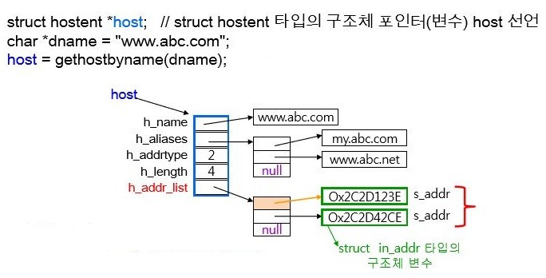

# CH 8\. IP주소와 도메인 이름 사이의 변환

## 도메인 이름을 이용해서 IP 주소 얻어오기 (리눅스)

```c
#include <netdb.h>

// 성공 시 hostent 구조체의 주소 값, 실패 시 NULL 포인터 반환
struct hostent *gethostbyname(const char *hostname);
```

## IP주소를 이용해서 도메인 정보 얻어오기 (리눅스)
인자 설명
- `addr` : IP 주소를 지니는 in_addr 구조체 변수의 포인터 전달.
- `len` : 첫 번째 인자로 전달된 주소 정보의 길이, IPv4의 경우 4, Ipv6의 경우 16 전달.
- `family` : 주소 체계 정보 전달. IPv4의 경우 AF_INET, Ipv6의 경우 AF_INET6 전달.
```c
#include <netdb.h>

// 성공 시 hostent 구조체의 주소 값, 실패 시 NULL 포인터 반환
struct hostent *gethostbyaddr(const char *addr, socklen_t len, int family);

// exam
struct hostent *host;
struct sockaddr_in addr;
addr.sin_addr.s_addr=inet_addr(argv[1]); // argv[1] 에는 ip 주소 담겨있음.
host = gethostbyaddr((char *)&addr.sin_addr, 4, AF_INT);
```

## 윈도우 버전
리눅스와 차이 없음. 똑같다.

## hostent 구조체의 정의

```c
struct hostent
{
  char  *h_name;      // official name
  char **h_aliases;   // alias list
  int    h_addrtype;  // host address type
  int    h_length;    // address length
  char **h_addr_list; // address list
}
```

- `h_name` : 공식 도메인 이름.
- `h_aliases` : 공식 도메인 이름 이외에 해당 메인 페이지에 접속할 수 있는 다른 도메인 이름.
- `h_addrtype` : h_addr_list 로 반환된 IP 주소의 주소체계에 대한 정보를 이 멤버를 통해 반환함.
  + IPv4의 경우 `AF_INET`
- `h_length` : 함수호출의 결과로 반환된 IP 주소의 크기 정보가 담긴다.
  + IPv4의 경우 4바이트.
  + Ipv6의 경우 16바이트.
- `h_addr_list` : 도메인 이름에 대한 IP주소가 문자열의 형태로 반환된다.



