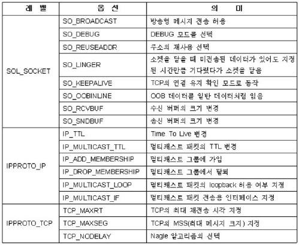

# CH 9. 소켓의 다양한 옵션

## 소켓의 다양한 옵션



## getsockopt (리눅스)

```c
#include <sys/sockhet.h>

// 성공 시 0, 실패 시 -1 반환
int getsockopt(int        sock,
               int        level,
               int        optname,
               void      *optval,
               socklen_t *optlen);
```

-   `sock` : 옵션확인을 위한 소켓의 파일 디스크립터 전달.
-   `level` : 확인할 옵션의 프로토콜 레벨 전달.
-   `optname` : 확인할 옵션의 이름 전달.
-   `optval` : 확인결과의 저장을 위한 버퍼의 주소 값 전달.
-   `optlen` : 네 번째 매개변수 optval로 전달된 주소 값의 버퍼크기를 담고 있는 변수의 주소 값 전달, 함수호출이 완료되면 이 변수에는 네 번째 인자를 통해 반환된 옵션 정보의 크기가 바이트 단위로 계산되어 저장된다.

> getsockopt 옵션을 활용해서 소켓 옵션 확인 예제
>
> -   [sock_type.c](https://github.com/wheejinv/C-TCPIP-Practice/blob/master/Linux/09_%EC%86%8C%EC%BC%93%EC%9D%98%20%EB%8B%A4%EC%96%91%ED%95%9C%20%EC%98%B5%EC%85%98/sock_type.c)

## setsockopt (리눅스)

```c
#include <sys/socket.h>

// 성공 시 0, 실패 시 -1 반환
int setsockopt(int         sock,
               int         level,
               int         optname,
               const void *optval,
               socklen_t   optlen);
```

-   `sock` : 옵션확인을 위한 소켓의 파일 디스크립터 전달.
-   `level` : 확인할 옵션의 프로토콜 레벨 전달.
-   `optname` : 확인할 옵션의 이름 전달.
-   `optval` : 확인결과의 저장을 위한 버퍼의 주소 값 전달.
-   `optlen` : 네 번째 매개변수 optval로 전달된 옵션 정보의 바이트 단위 크기 전달.

## getsockopt (윈도우)

```c
#include <winsock2.h>

// 성공 시 0, 실패 시 SOCKET_ERROR 반환
int getsockopt(SOCKET sock,
               int    level,
               int    optname,
               char  *optval,
               int   *optlen);
```

-   `sock` : 옵션확인을 위한 소켓의 핸들 전달.
-   `level` : 확인할 옵션의 프로토콜 레벨 전달.
-   `optname` : 확인할 옵션의 이름 전달.
-   `optval` : 확인결과의 저장을 위한 버퍼의 주소 값 전달.
-   `optlen` : 네 번째 매개변수 optval로 전달된 주소 값의 버퍼크기를 담고 있는 변수의 주소 값 전달, 함수호출이 완료되면 이 변수에는 네 번째 인자를 통해 반환된 옵션 정보의 크기가 바이트 단위로 계산되어 저장된다.

## setsockopt (윈도우)

```c
#include <winsock2.h>

// 성공 시 0, 실패 시 SOCKET_ERROR 반환
int setsockopt(SOCKET      sock,
               int         level,
               int         optname,
               const char *optval,
               int         optlen);
```

-   `sock` : 옵션확인을 위한 소켓의 파일 디스크립터 전달.
-   `level` : 확인할 옵션의 프로토콜 레벨 전달.
-   `optname` : 확인할 옵션의 이름 전달.
-   `optval` : 확인결과의 저장을 위한 버퍼의 주소 값 전달.
-   `optlen` : 네 번째 매개변수 optval로 전달된 옵션 정보의 바이트 단위 크기 전달.
